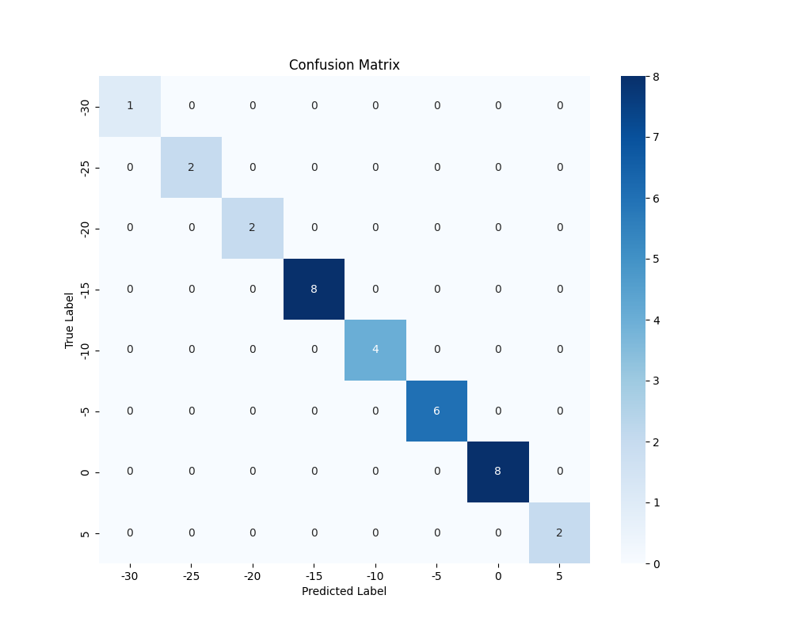
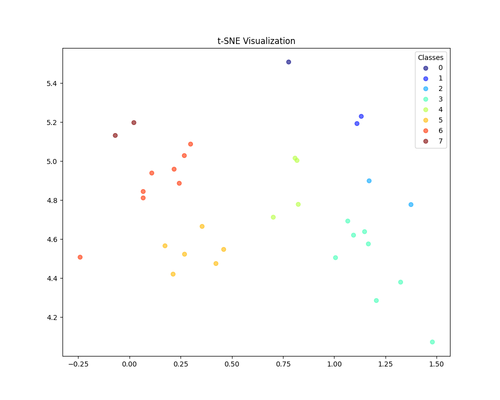

# Scrap-grading

This repository contains a Steel Scrap Grading model built using a Convolutional Neural Network (CNN). The model classifies steel images into specific categories. 

The available rating categories are:-30, -25, -20, -15, -10, -5, 0, 5

## The project includes:

- A **CNN-based image rating predictor** that classifies images into one of the specified rating categories.
- A simple **User Interface (UI)** for selecting an image from your computer and predicting its rating.
- **Visualization tools** for generating a confusion matrix and t-SNE plot to evaluate and understand model performance.

## Results

### Confusion Matrix

### t-SNE Visualization

